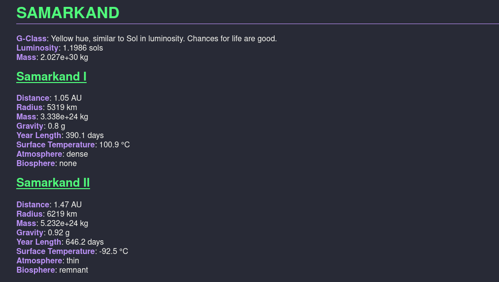

# rhogen

This is a commandline star system generated that draws heavily on the [Worldbuilding Guide](http://www.projectrho.com/public_html/rocket/worldbuilding.php) found on the Atomic Rockets website at [projectrho.com](http://www.projectrho.com/public_html/rocket/). It generates semi-realistic star systems and includes calculations for mass, luminosity, radius, distance, roche/hill limits, temperature and more!

The only dependency this tool has is the PyCairo library. To get started, just clone the repository and run:

```sh
$ rhogen.py -h
```

Goals for the future include:

- Generate asteroid belts, represented on the map as different-colored orbits with no planets.
- Generate satellites around planets.
- Generate rings around planets.

## Output Formats

The tool has three output formats; you can output the generated system in either or all of them with the `-oJ`, `-oM` and `-oI` options.

**JSON Data**


**MarkDown Report**



**System Diagram**


